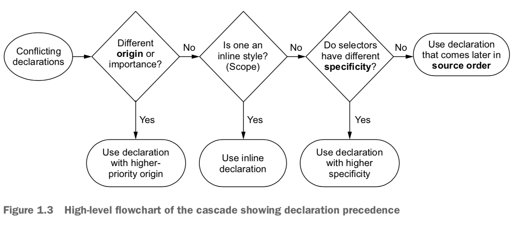
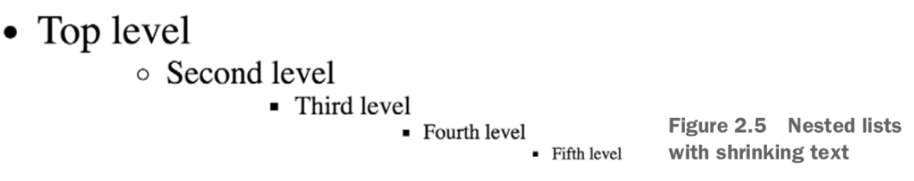

- [Cascade specificity](#cascade-specificity)
- [Inheritance](#inheritance)
  - [`inherit` keyword](#inherit-keyword)
  - [`initial` keyword](#initial-keyword)
- [Shorthand properties](#shorthand-properties)
- [Relative units](#relative-units)


## Cascade specificity



**Origin priority order**:
1. Author important 
2. Author
3. User agent


**mnemonic for link styling order: LoVe/HAte—link, visited, hover, active.**

```css
a:link {
  color: blue;
  text-decoration: none;
}

a:visited {
  color: purple;
}

a:hover {
  text-decoration: underline;
}

a:active {
  color: red;
}
```

## Inheritance

### `inherit` keyword

Example:


```css
.footer {
The inherit value Global link color
    color: #666;
  background-color: #ccc;
  padding: 15px 0;
  text-align: center;
  font-size: 14px;
}
.footer a {
  color: inherit;
  text-decoration: underline;
}

```

### `initial` keyword


```css

.footer a {
  color: initial;
  text-decoration: underline;
}

```

## Shorthand properties

* `font`: font-style, font-weight, font-size, line- height, and font-family
* `background`: background-color, background-image, background-size, background-repeat, background-position, background-origin, background-chip, and background- attachment


**Most shorthand properties let you omit certain values and only specify the bits you’re concerned with. It’s important to know, however, that doing this still sets the omitted values; they’ll be set implicitly to their initial value. This can silently override styles you specify elsewhere.**


This:

```css

h1 {
  font-weight: bold;
}
.title {
  font: 32px Helvetica, Arial, sans-serif;
}
```

is equal to this:
```css
h1 {
  font-weight: bold;
}
.title {
  font-style: normal;
  font-variant: normal;
  font-weight: normal;
  font-stretch: normal;
  line-height: normal;
  font-size: 32px;
  font-family: Helvetica, Arial, sans-serif;
}

```

 `margin` and `padding`: top, right, bottom, left (clockwise, mnemonic: TRouBLe)

 properties that accept only 2 values ( `background-position`, `box-shadow`, and `text-shadow`): right/left, top/bottom => (x,y) Cartesian grid

## Relative units
Properties beside `font-size`: 1 em = 1 * `font-size` of element

`font-size`: 1 em = 1 * inherited `font-size`

Shrinking text occurs when you nest lists several levels deep and apply an em-based font size to each level.

```html
<ul>
  <li>Top level
    <ul>
      <li>Second level
        <ul>
          <li>Third level
            <ul>
              <li>Fourth level
                <ul>
                  <li>Fifth level</li>
</ul> </li>
</ul> </li>
</ul> </li>
</ul> </li>
</ul>
```

wrong way:
```css

body {
  font-size: 16px;
}
ul {
  font-size: .8em;
}


```



quick fix:
```css

ul {
  font-size: .8em;
}
ul ul {
  font-size: 1em;
}

```

It would be nicer if you could avoid overriding rules by inching up the specificity of the selectors => rems
