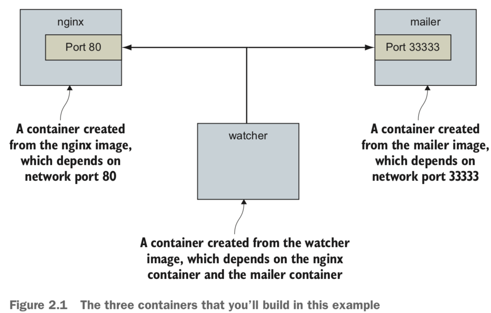
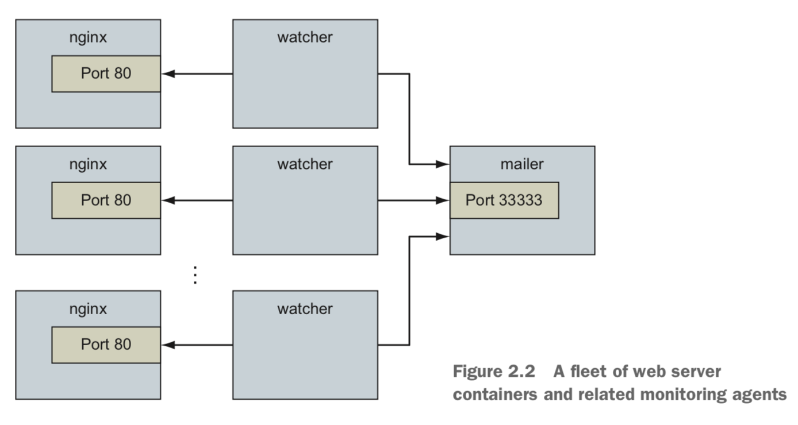
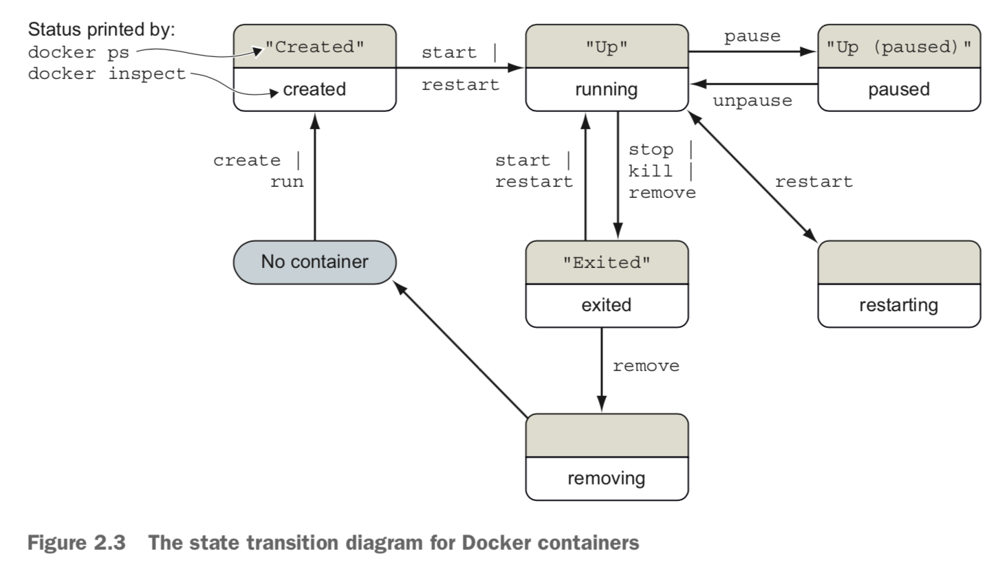
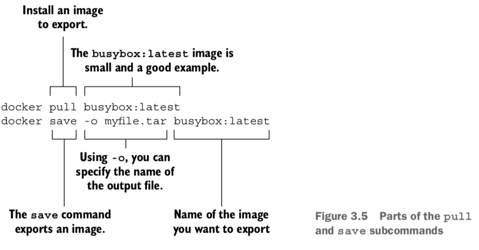

- [Chapter 2](#chapter-2)
  - [Capturing container ID with bash](#capturing-container-id-with-bash)
  - [Capturing container ID with CID file](#capturing-container-id-with-cid-file)
  - [Container states diagram](#container-states-diagram)
  - [Read-only filesystem](#read-only-filesystem)
  - [Linking database](#linking-database)
  - [Environmnent variable injection](#environmnent-variable-injection)
  - [Restarting container](#restarting-container)
      - [Init systems/Start up script](#init-systemsstart-up-script)
  - [Clean up](#clean-up)
  - [Summary](#summary)
- [Chapter 3](#chapter-3)
  - [Images](#images)
  - [Union file system](#union-file-system)
  - [Summary](#summary-1)
## Chapter 2


```bash
docker run dockerinaction/hello_world
docker images
docker container ls

docker run --detach     --name web nginx:latest
docker container ls

docker run -d     --name mailer      dockerinaction/ch2_mailer

docker run --interactive --tty     --link web:web     --name web_test     busybox:1.29 /bin/sh

```

`--detach` `-d`: background process
`--interactive`: keep stdin open for the container
`--tty`: attach virtual terminal to container.

`-it` = `--interactive` + `--tty`

To detach the terminal from a container: `Ctrl +P` then `Ctr+Q`

```bash
docker ps -a # show all containers

#in case need to restart
docker restart web
docker restart mailer
docker restart agent

# read long-term persistence log
docker logs web
docker logs mailer
docker logs agent

#read logs and update

docker logs --follow #or -f

docker exec [container_name] [command] #execute a command in a specific container
```

`docker run --pid [namespace]`: use a different PID namespace than the standard isolated namespace created for each new container

---


`docker rename webid webid-old`

`docker create`: similar to `docker run`, but the container is created in a stopped state (so you can get the container ID)

### Capturing container ID with bash
```
CID=$(docker create nginx:latest)
echo $CID

CID=$(docker ps --latest --quiet)
echo $CID

CID=$(docker ps -l -q) #get first 12 chartacters, if want full use --no-trunc
echo $CID


```

This approach is ok but not good in the case of multiple users or automated processes that need to share the information => use container ID (CID) file

### Capturing container ID with CID file
`docker create --cidfile /tmp/web.cid nginx`
CID files can be shared with containers easily and renamed for that container. This uses a Docker feature called volumes (chapter4)

To avoid naming conflict of cid files:
`/containers/web/customer1/web.cid` and 
`/containers/web/customer8/web.cid`

```

MAILER_CID=$(docker run -d dockerinaction/ch2_mailer)

WEB_CID=$(docker run -d nginx)

AGENT_CID=$(docker run -d \
    --link $WEB_CID:insideweb \
    --link $MAILER_CID:insidemailer \
    dockerinaction/ch2_agent)

```

The `--link` mechanism injects IP addresses into dependent containers, and containers that aren’t running don’t have IP addresses. `--link` is legacy, since it's **unidirectional**, while `user defined networks` are **bidirectional**


### Container states diagram



### Read-only filesystem

```
docker run -d --name wp --read-only \
    wordpress:5.0.0-php7.2-apache

docker inspect --format "{{.State.Running}}" wp #true if container is running, false if not

```

=> Not running because cannot create lock file 
**Solution**: Create writable container to see which files are changed so we can make exceptions


```
docker run -d --name wp_writable wordpress:5.0.0-php7.2-apache

#view locations where files are changed
docker container diff wp_writable

```

Give permission exceptions:

```
docker run -d --name wp2 \
  --read-only \ # Makes container’s root filesystem read-only
  -v /run/apache2/ \# Mounts a writable directory from the host
  --tmpfs /tmp \ #Provides container an in- memory temp filesystem
  wordpress:5.0.0-php7.2-apache


```

### Linking database

```
docker run -d --name wpdb \
    -e MYSQL_ROOT_PASSWORD=ch2demo \
    mysql:5.7

docker run -d --name wp3 \ #Uses a unique name
    --link wpdb:mysql \ #Creates a link to the database
    -p 8000:80 \ #Directs traffic from host port 8000 to container port 80
    --read-only \
    -v /run/apache2/ \
    --tmpfs /tmp \
    wordpress:5.0.0-php7.2-apache

docker inspect --format "{{.State.Running}}" wp3

```

Full script:
```
#!/bin/sh
DB_CID=$(docker create -e MYSQL_ROOT_PASSWORD=ch2demo mysql:5.7)
docker start $DB_CID

MAILER_CID=$(docker create dockerinaction/ch2_mailer)

docker start $MAILER_CID

WP_CID=$(docker create --link $DB_CID:mysql -p 80 \
    --read-only -v /run/apache2/ --tmpfs /tmp \
    wordpress:5.0.0-php7.2-apache)

docker start $WP_CID

AGENT_CID=$(docker create --link $WP_CID:insideweb \
    --link $MAILER_CID:insidemailer \
    dockerinaction/ch2_agent)
docker start $AGENT_CID
```

### Environmnent variable injection

```
docker run --env MY_ENVIRONMENT_VAR="this is a test" \ #Injects an environment variable
busybox:1.29 \
env
```

Hosting the database on different machine, not using `link`:

```sh
docker create \
    --env WORDPRESS_DB_HOST=<my database hostname> \
    --env WORDPRESS_DB_USER=site_admin \
    --env WORDPRESS_DB_PASSWORD=MeowMix42 \
    wordpress:5.0.0-php7.2-apache

```
Hosting the database on same machine but replace default values

```sh
#!/bin/sh
if [ ! -n "$CLIENT_ID" ]; then # Assumes $CLIENT_ID variable is set as input to script
    echo "Client ID not set"
    exit 1
fi
WP_CID=$(docker create \
    --link $DB_CID:mysql \ #Creates link using DB_CID
    --name wp_$CLIENT_ID \
    -p 80 \
    --read-only -v /run/apache2/ --tmpfs /tmp \
    -e WORDPRESS_DB_NAME=$CLIENT_ID \
    --read-only wordpress:5.0.0-php7.2-apache)
docker start $WP_CID
AGENT_CID=$(docker create \
        --name agent_$CLIENT_ID \
    --link $WP_CID:insideweb \

#call the script
CLIENT_ID=dockerinaction ./start-wp-multiple-clients.sh

```

### Restarting container

`--restart` modes
 Never restart (default)
 Attempt to restart when a failure is detected
 Attempt for some predetermined time to restart when a failure is detected 
 Always restart the container regardless of the condition

`docker run -d --name backoff-detector --restart always busybox:1.29 date` 


During backoff periods, the container isn’t running. Containers waiting to be restarted are in the restarting state => cannot run diagnostic programs in broken => A more complete strategy is to use containers that start lightweight init systems.

##### Init systems/Start up script

Most popular: `runit, Yelp/dumb-init, tini, supervisord, tianon/gosu`

`docker run -d -p 80:80 --name lamp-test tutum/lamp` The LAMP image uses `supervisord`

`docker top lamp-test`: see which processes running inside this container

**Test restart**
`docker exec lamp-test ps`
`docker exec lamp-test kill <PID>`

**Entrypoints**

Entrypoints are perfect places to put code that validates the preconditions of a container.
```
docker run --entrypoint="cat" \
    wordpress:5.0.0-php7.2-apache \
    /usr/local/bin/docker-entrypoint.sh
```

### Clean up

`docker rm wp`

`docker stop` allows time for cleanup, `docker kill` and `docker rm -f` do not

Short-lived containers, remove upon exit: 
`docker run --rm --name auto-exit-test busybox:1.29 echo Hello World`

`docker rm -vf $(docker ps -a -q)`

### Summary
The primary focus of the Docker project is to enable users to run software in contain- ers. This chapter shows how you can use Docker for that purpose. The ideas and fea- tures covered include the following:

- Containers can be run with virtual terminals attached to the user’s shell or in detached mode.
- By default, every Docker container has its own PID namespace, isolating process information for each container.
- Docker identifies every container by its generated container ID, abbreviated container ID, or its human-friendly name.
- All containers are in any one of six distinct states: created, running, restarting, paused, removing, or exited.
- The docker exec command can be used to run additional processes inside a running container.
- A user can pass input or provide additional configuration to a process in a con- tainer by specifying environment variables at container-creation time.
- Using the --read-only flag at container-creation time will mount the container filesystem as read-only and prevent specialization of the container.
- A container restart policy, set with the --restart flag at container-creation time, will help your systems automatically recover in the event of a failure. Docker makes cleaning up containers with the docker rm command as simple as creating them.

---
## Chapter 3

### Images
An image is a file. It holds files that will be available to containers created from it and metadata about the image. This metadata contains labels, environment variables, default execution context, the command history for an image, and more.

**Load image from file**

`docker load –i myfile.tar`

**Using Dockerfile**
```shell
git clone https://github.com/dockerinaction/ch3_dockerfile.git
docker build -t dia_ch3/dockerfile:latest ch3_dockerfile
```
**Alternatives to docker hub**
You can install software in three other ways:
 You can use alternative repository registries or run your own registry.
 You can manually load images from a file.
 You can download a project from some other source and build an image by
using a provided Dockerfile.


### Union file system
Allow layers to access files of each other


Union filesystems use a pattern called copy-on-write, and that makes implementing memory-mapped files (the mmap system call) difficult. Some union filesystems provide implementations that work under the right conditions, but it may be a better idea to avoid memory-mapping files from an image.

If you want to specifically tell Docker which filesystem to use, do so with the --storage-driver or -s option when you start the Docker daemon. 

Most issues that arise with writing to the union filesystem can be addressed without changing the storage provider. These can be solved with volumes

### Summary

The task of installing and managing software on a computer presents a unique set of challenges. This chapter explains how you can use Docker to address them. The core ideas and features covered by this chapter are as follows:
 Human users of Docker use repository names to communicate which software they would like Docker to install.
 Docker Hub is the default Docker registry. You can find software on Docker Hub through either the website or the docker command-line program.
 The docker command-line program makes it simple to install software that’s distributed through alternative registries or in other forms.
 The image repository specification includes a registry host field.
 The docker load and docker save commands can be used to load and save
images from TAR archives.
 Distributing a Dockerfile with a project simplifies image builds on user machines.
 Images are usually related to other images in parent/child relationships. These
relationships form layers. When we say that we have installed an image, we are
saying that we have installed a target image and each image layer in its lineage.
 Structuring images with layers enables layer reuse and saves bandwidth during
distribution and storage space on your computer and image distribution servers.

---
